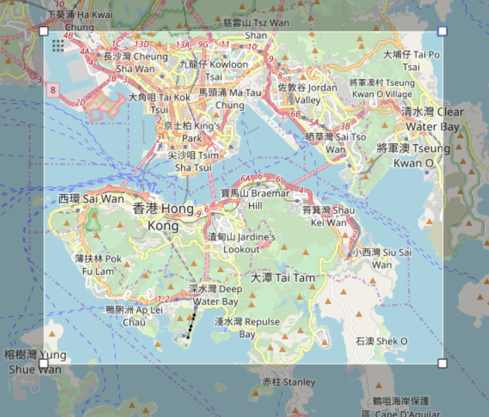

# OpenStreetMap Data Wrangling with SQL

本项目为 Udacity 数据分析师纳米学位实践项目，使用 SQL 对 OpenStreetMap 的数据进行整理。

项目选取的区域是香港的一部分。经纬度边界：22.2233, 114.115, 22.3475, 114.275

- 项目报告：[OSM Data Case Study](/report/OSM-Data-Case-Study.md)
- 项目中所用代码：[code](/code)
- 课程练习题代码：[code/quiz](/code/quiz)
- 项目所有数据集：[dataset](/dataset)
- 以下为选定区域示意图：

